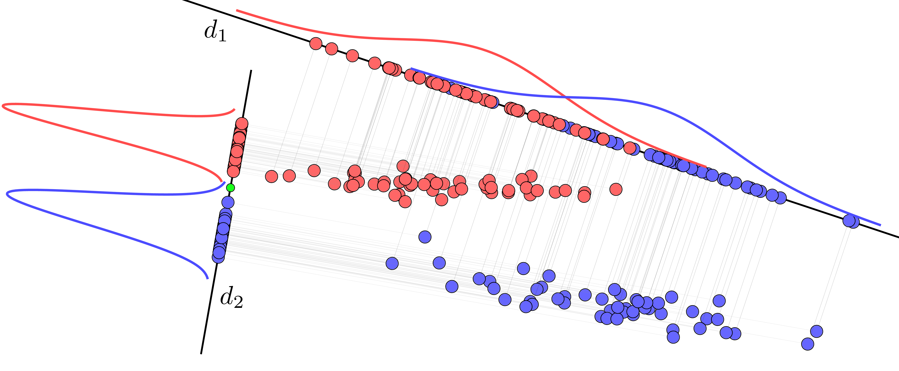

# Linear Discriminant Analysis (LDA)
- Author: [Duong T.](https://duongttr.github.io/)
- Created at: Jan 21st, 2023
- [Source code](../../decomposition/LDA.py)

## Introduction
While PCA is the most popular alogorithm which used for dimension reduction, but this algorithm has a disadvantage: **it is for unspervised learning**. Take a look at this picture:

*Source: https://machinelearningcoban.com/2017/06/30/lda/*

With PCA, it doesn't see the colors (reds and blues) of samples, which means all of samples are the same, and PCA will see that the best component is $d_1$. 

But the new projected samples on $d_1$ are bad with classification while they are overlapped a lot.

LDA was born will solve this problem. It is a **supervised learning**, which the labels (y) affects the result.

## Step-by-step
Given that you have a dataset $(X, y)$. 

$X.shape=(N,F)$ and $y.shape = (N,)$.
### Step 1: Calculate the overall mean for each features in $X$

$$
\mu = \frac{1}{N}\sum_{j=0}^{F}\sum_{i=0}^{N}{X_{i:j}}
$$

### Step 2: With each class, calculate "within-class" scatter matrix and "between-class" scatter matrix
Suppose that $X_c$ is a subset of sample of class $c$, size of subset is $N_c$.
$$
\mu_c = \frac{1}{N_c}\sum_{j=0}^{F}\sum_{i=0}^{N_c}{X_{i:j}}
$$

Calculate "within-class" scatter matrix of each class, a sum up all of them:
$$
S_W = \sum_i^{C}(X_i - \mu_i)^2
$$
Calculate "between-class" scatter matrix:
$$
S_B = \sum_i^{C} N_i * (\mu_i - \mu)^2
$$

### Step 3: Calculate target
$$
T = S_W^{-1} S_B
$$

For short, we need to maximize $T$, or $S_B$ must to be maximum and $S_W$ must to be minimum.

### Step 4: Calculate eigen-components of target
$$
V,E=eigen(A)
$$
Where $V$ is eigenvalues, and $E$ is eigenvectors.

### Step 5: Sort the eigenvectors due to eigenvalues, and transform $X$ by $E$.

If you want to know more about mathematics behind, you should take a look at references.

## References
https://machinelearningcoban.com/2017/06/30/lda/
https://en.wikipedia.org/wiki/Linear_discriminant_analysis
https://towardsdatascience.com/linear-discriminant-analysis-explained-f88be6c1e00b